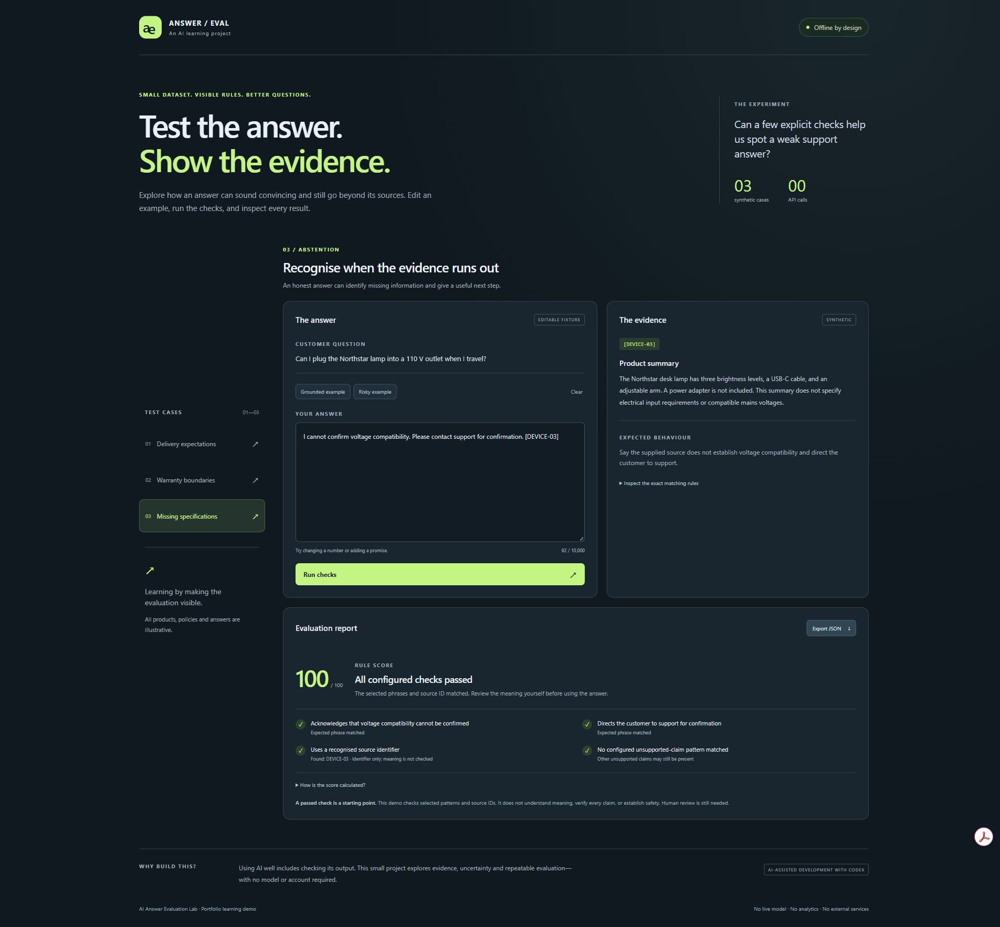

# AI Answer Evaluation Lab

A small, interactive learning project about evaluating AI-style support answers against evidence. It uses **three synthetic cases and manually written illustrative answer fixtures**. No live language model is called, and no API key is needed.

The project was created with **AI-assisted development using OpenAI Codex**. It is a new portfolio learning exercise, not a claim of previous AI engineering employment or production AI deployment.

**[Open the interactive demo](https://rainbowmoko.github.io/ai-answer-evaluation-lab/)** · [View the source](https://github.com/RainbowMoko/ai-answer-evaluation-lab)

The hosted version is a static website. Answer evaluation runs in your browser, with no model API, account or backend required.



## Try it locally

Requirements: Node.js 20 or later. There are no third-party dependencies and no installation step.

```sh
npm start
```

On Windows PowerShell, use `npm.cmd start` if script execution policy blocks `npm.ps1`.

Open **http://127.0.0.1:4173** in a browser. Press Ctrl+C in the terminal to stop the server. The server binds only to your own computer and serves a small explicit list of demo files. Opening `index.html` directly as a file is not supported because browsers restrict local JavaScript module imports.

## What to explore

1. Choose delivery expectations, warranty boundaries, or missing specifications.
2. Read the fictional source material and expected behaviour.
3. Switch between the grounded and risky examples.
4. Edit the answer and run the checks. Try a wrong number, an invented guarantee, an unknown source ID, or an unsupported voltage claim.
5. Inspect the exact regular expressions and the score explanation.
6. Export the current report as JSON. The export includes the answer, source context, rules results, evaluator version, limitations, and timestamp.

Editing an answer invalidates the displayed report and disables export until it is evaluated again. Switching cases loads a fresh example; edits are not retained between cases or page reloads.

## Evaluation design

The pure `evaluateAnswer(testCase, answer)` function has no DOM or network dependency. It normalises selected typographic punctuation, runs a small list of explicit regular-expression checks, detects configured unsupported-claim patterns, and checks bracketed source identifiers such as `[SHIP-01]`.

- Required phrase matches: up to **75 points**.
- A recognised source identifier with no unknown identifiers: **25 points**.
- Each configured unsupported claim or unknown source identifier: **−25 points**.
- Scores cannot fall below zero. Empty answers always score zero.
- All required checks and the citation check must pass, with no flagged claim, for the result to be `checks_passed`.

The missing-specifications case illustrates **abstention**: acknowledge what cannot be confirmed and offer a next step. A refusal or qualification is not inherently a poor answer when the evidence is insufficient.

The score is a transparent teaching device, **not a calibrated confidence score, factual accuracy percentage, or production acceptance threshold**.

## Limitations worth understanding

This is **not comprehensive hallucination detection**. Regex rules recognise a few phrases, not meaning. They can miss valid paraphrases, fail to catch new unsupported claims, and misinterpret quotation, negation, or statements contradicted elsewhere. A source identifier earns citation credit without checking whether the source supports each sentence. The examples are small, hand-written and intentionally easy to inspect; they are not an independent benchmark or model performance evaluation.

No answer here should be used as real electrical, product, shipping or warranty guidance. All source material is fictional. The demo does not connect to an actual business or customer system.

## Technical decisions

- **Browser JavaScript + ES modules:** easy to inspect and run without a framework or build tooling.
- **Separate data, evaluator and UI:** the same evaluator can be tested independently or reused by a future model adapter.
- **Deterministic rules:** reproducible results with every scoring decision visible.
- **Safe text rendering:** editable text is handled with `textContent` and textarea values, not injected as HTML.
- **Local-only operation:** no analytics, external fonts, assets, model requests or storage. JSON is downloaded locally only when requested.
- **Responsive and keyboard accessible:** labelled controls, visible focus, selected-state announcements and a live evaluation region.

## Test

```sh
npm test
```

Or `npm.cmd test` on Windows PowerShell. The Node built-in test runner covers grounded and risky fixtures, missing/unknown citations, deduplication, incorrect numeric substrings, Unicode punctuation, missing abstention steps, contradictory claims, score floors, input limits, JSON reports, immutability and deterministic runs.

Test execution is documented in `VALIDATION.md`. Browser inspection is a separate check; passing unit tests does not establish visual quality or accessibility conformance.

## Files

| File | Purpose |
| --- | --- |
| `data.mjs` | Synthetic sources, questions, expected behaviour, fixtures and rules |
| `evaluator.mjs` | Pure evaluation and export-report functions |
| `app.js` | Browser interaction, report rendering and download |
| `index.html`, `styles.css` | Responsive interface |
| `server.mjs` | Dependency-free local static server |
| `test/evaluator.test.mjs` | Behavioural and boundary tests |

## Next learning steps

1. Add independent paraphrases and tricky counterexamples, then measure false passes and false failures instead of tuning only to the supplied fixtures.
2. Add sentence-level references and distinguish unsupported claims from incomplete answers.
3. Introduce a provider adapter for real model responses, with keys held in a server-side environment, explicit cost limits and reproducible test runs.
4. Compare model output against a held-out dataset and human labels. Keep model generation separate from evaluation.
5. Add a test history view and compare prompt versions without claiming improvement from a handful of examples.

## Short portfolio description

> An offline learning demo for checking AI-style support answers against synthetic evidence. Built with JavaScript and AI-assisted development using Codex, it makes deterministic rules, source checks, abstention and JSON evaluation reports visible. No live model calls; designed to explore both the usefulness and limitations of simple evaluation methods.

## License

MIT. See `LICENSE`.
